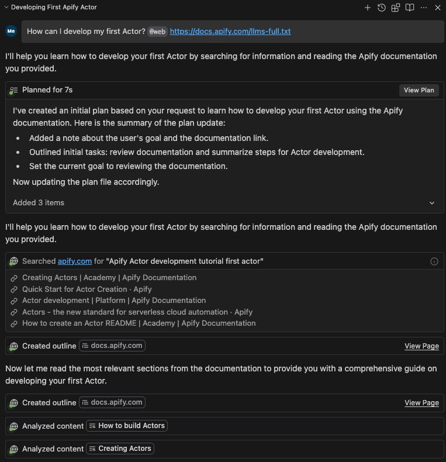

**Set up your environment, choose tools, and build workflows for effective vibe coding.**

---

import { RULES_AND_INSTRUCTIONS_PROMPT } from "@site/src/utils/ai-prompts";
import PromptButton from "@site/src/components/PromptButton";

This guide explains how to enhance your development workflow by leveraging `llms.txt` and `llms-full.txt` with an AI assistant. You will learn how to provide foundational context and further refine AI's behavior with specific rules and instruction files.

## `llms.txt` and `llms-full.txt`

Search engines weren't built for Large Language Models (LLMs), but they needs context. That's why we've created `[llms.txt](https://docs.apify.com/llms.txt)` and `[llms-full.txt](https://docs.apify.com/llms-full.txt)` for our documentation. These files follow the [growing standard](https://llmstxt.org/) for LLMs consumption.

| File | Purpose | Impact on LLM Processing |
| :--- | :--- | :--- |
| `/robots.txt` | Tells crawlers where to go. | It doesn't help with content understanding. |
| `/sitemap.xml` | Lists pages. | It doesn't help with content. LLM systems still need to parse complex HTML and handle extra info, which clutters the context window. |
| `/llms.txt` | Solves LLMs problems by presenting content optimized for LLM processing. | It overcomes context window limits and removes markup and scripts. |

### Use llms.txt and llms-full.txt

LLMs don't automatically discover llms.txt files, you need to add the link manually. Some tools like [Cursor](https://www.cursor.com/) provide settings for this.

#### Cursor

Go to: `Settings -> Cursor Settings -> Indexing & Docs -> Add Doc`.

Now, you can just provide the link to Apify `llms-full.txt`:

```markdown
https://docs.apify.com/llms-full.txt
```


#### Windsurf

Open Windsurf Cascade, and add context via `@web`:



:::note Windsurf @docs

Windsurf provides the `@docs` command, but you cannot customize it. It means that you cannot add your own documentation.

:::

#### GitHub Copilot

Open Copilot Chat mode, and add context via `#fetch`:


:::note GitHub Copilot and documentation

Similar to Windsurf, GitHub Copilot does not provide an option for adding your own documentation.

:::

#### Ask AI

New to Apify? Ask questions and provide the `llms.txt` link. Popular AI models can search the web. With the right context, you get better answers:


### Add rules

To get the most from AI IDEs, add rules or instructions.

See how to set up rules for your AI IDEs:

- [Cursor Rules](https://docs.cursor.com/en/context/rules)
- [Windsurf Rules](https://docs.windsurf.com/windsurf/cascade/memories#rules)
- [GitHub Copilot instructions](https://docs.github.com/en/copilot/how-tos/configure-custom-instructions/add-repository-instructions)

#### Apify rules and instructions

The best rules and instructions are specific for individual use cases, but we provide a prompt to help you get start with creating rules and instructions:

<PromptButton prompt={RULES_AND_INSTRUCTIONS_PROMPT}/>

#### Keep your rules and instructions up to date

As the project evolves, you might introduce new things. Always make sure that your rules are up to date.

### Best practices

- **Small tasks**: Don't ask AI for many tasks at once. Break complex problems into smaller pieces. Solve them step by step.

- **Iterative approach**: Work iteratively with clear steps. Start with a basic implementation and gradually add complexity.

- **Versioning**: Version your changes often using git. This lets you track changes, roll back if needed, and maintain a clear history.

- **Security**: Don't expose API keys, secrets, or sensitive information in your code or conversations with LLM assistants.
